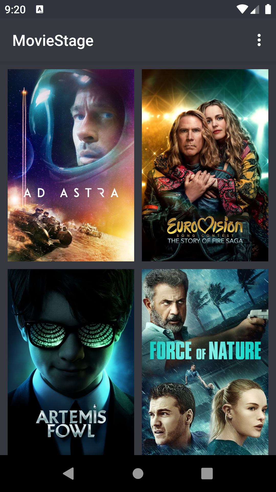

### Movie Stage

This app user [The Movie DB](https://www.themoviedb.org) api to get detaile of movies so you need sign up in [The Movie DB](https://www.themoviedb.org) and
get your api key

After you get your api key modify this class **/app/Commons.java**

```java
public static final String API_KEY = "Your API Key Goes Here";
```

## Screenshots
<div>



</div>
